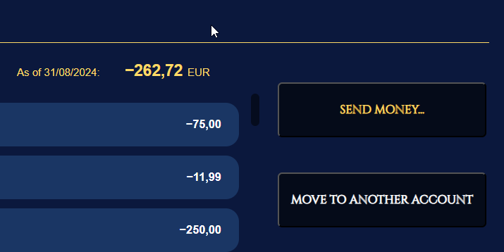
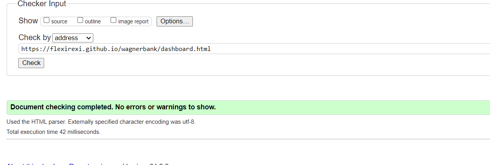

# wagnerbank

(Developer: Felix Lehmann)

This project is a mobile banking app of a fictive savings bank named Wagner Bank. Existing customers can login and review their acounts, including credit cards, deposit acounts etc. Naturally, they can make external payments as well as internal money movements (credit cards are excluded from this feature). Since this app is interactive, it provides many opportunities for further features which haven't been implemented yet, such as registration request, loan requests (mortgages, cars, consumer loans), investment depots etc.

**The challenges** in this project is that everything needs to be written in plain JavaScript - no SQL, no charts, no pandas etc. That has forced me to become somewhat creative in some features: how to save variables? how to update data? how to handle large data set such as transactions lists etc. I will explain in the upcoming chapters.

__Information on test user accounts:__   
The data sets are completely fictive, though somewhat characteristic. To create dummy data I used historical famous persons for user accounts. Their birthdays and other important dates found their way into the IBANs. The transactions as well as the amounts are generated randomly.  
**You will find login data on the top right corner of the start page**

[Live Webpage](https://flexirexi.github.io/wagnerbank/)

___

# Table of content

1. [User Experience](#user-experience)
   1. [Target audience](#target-audience)
   2. [User expectations](#user-expectations)
   3. [User Stories](#user-stories)
      1. [First-time user](#first-time-user)
      2. [Returning user](#returning-user)
   4. [Design](#design)
      1. [Fonts](#font)
      2. [Structure](#structure)
      3. [Wireframes](#wireframes)
2. [Technologies used](#technologies-used)
   1. [Languages](#languages)
   2. [Frameworks & tools](#frameworks-and-tools)
3. [Features](#features)
   1. [Existing features](#existing-features)
   2. [Upcoming features](#upcoming-features)
4. [Testing](#testing)
   1. [Validator testing](#validator-testing)
      1. [HTML](#html)
      2. [CSS](#css)
      3. [Performance](#performance)
      4. [Responsiveness](#responsiveness)
      5. [Accessability](#accessability)
  2. [Fixed bugs](#fixed-bugs)
  3. [Unfixed bugs](#unfixed-bugs)
  4. [User Story testing](#user-story-testing)
5. [Deployment](#deployment)
6. [Credits](#credits)
   1. [Content](#content)
   2. [Media](#media)

# User Experience
## Target audience
- existing clients of Wagner Bank (including test logins)
- clients who want to review and manage their savings from a mobile app rather than a desktop version

## User expectations
- an intuitive and simple web application to review and manage transactions and savings accounts
- visitors quickly can send money
- visual impression (no old legacy stuff, even when it's sometimes the best..)
- modern design that meets the zeitgeist 

## User Stories
### First-time user
*As a first-time user*
- this application is not done for first time user, an account is required (for further development, however, a registration form could be done)

### Returning user
*As a returning user*
- I want to see a dashboard of all my accounts and their current monetary worth
- I want the current consolidated total amount to be shown 
- I want to see the transactions of all my accounts, where when and, if possible, why
- I want to send money to extern third parties
- I want to move money from one account to another with immediate effect
- I want to be logged out automatically after 3 minutes inactivity - I want safety

## Design
### Fonts
Arial has been used as a neutral font without serifs.
"Cinzel" font (taken from [Google fonts](https://fonts.google.com/specimen/Ubuntu)) is used for headers. Presented in a goldish yellow, it fits to the image of a bank. The unique character of capital letters only (large capitals and small capital letters) undelines the elegance for headers.

### Structure
One core concept of the structure of all pages is that the bodies are not scrollable. Only lists that would exceed the viewport height will be scrollable. I chose this way because the app shall have a mobile character and shall help the visitor to really quickly get things done. Straight to the point so to say.

In fact, there are 4 html pages: login, dashboard, account history and money transfer. They are connected the order mentioned like a chain. For instance, login can't connect to the account details directly and the dashboard can't forward to the money transfer. But all pages can log out the user.

The login page (index.html) is very minimalistic. It becomes clear that this website is for quick use. After a successful login, the visitor will be forwarded to the dashboard like the overview of existing accounts, including the credit card. The non-legacy items of the accounts-list are clickable and will open the transactions page of the respective account. Here, the visitors will see their transaction history and their details. They can also take actions such as sending money.

When sending money or moving money to another account, a classical form will be used. 

### Wireframes in Balsamiq
As already mentioned, the app is primarily designed for mobile use. So, there are only a few features left that need adjustment for different screen sizes. Instead of buttons for the desktop, use a menu on mobile screens. The rest stays the same (apart from some minor size changes..) 

  
login (index.html)

  

  
dashboard page (dashboard.html)

  

  
account history (account.html)

  

  
move and external money transfer (send.html)

  
  

# Technologies used
## Languages
- HTML
- CSS
- JS

## Frameworks and tools
- Git
- GitHub
- Gitpod
- Tinypng
- Greenshot
- Balsamiq
- wave tool
- Google Fonts
- Font Awesome
- Google Chrome dev tools

# Features
## Existing features
### Logo and Navigation bar
- fully responsive
- on all pages
- in mobile size, buttons on the right side of lists "collapse" to a menu button and move to the top right, straight below the nav bar
- within the nav bar, on the right, there is always the possibility to logout
- logo is not clickable, since there is no "home page", the pages within the web app needs to be chained as mentioned earlier 
- on the pages account and send, there are back buttons 

action buttons (mobile mode) as a collapse version of buttons (desktop size):  

action buttons expanded:

### dashboard - the "landing page" for returning visitors:
- non-legacy list layout
- lists all accounts for the logged in user, as well as their current worth and account kind, account name /number:
- sums up all current amounts to a total amount

### automatic logout after 3 minutes inactivity
- important in mobile banking: a timer to logout automatically
- usually, a client who wants to "quickly get things done" tend to forget to log out properly - let the timer do it for him/her
- the feature: at the bottom right the countdown is shown and when the timer reaches 25 seconds (left), then a message box will show up where the visitor has to act to stay logged in

### transaction page
- it's always useful to have an overview of all your recent transactions and current balance
- the visitor will see a list of transactions with details/references and amounts - quite usual mobile banking
- please note: the test accounts have all just fictive data, but the amounts match, also in regards to dates and time (several transactions at the same day which is a realistic scenario)
- the transactions are sorted by datetime, descending, meaning the latest at the top
- in addtion, when the client enters a transaction, it will show up accordingly

### account actions: send/move money
- this is a feature where a desktop user clicks on a button, a mobile user selects from a menu
- the client can "move" money between his/her accounts as well as send extern

### send/move money - form
- after clicking on the action buttons/menu buttons, the visitor will be redirected to a money transfer page, a simple form to fill and confirm
- the features: one can't send/receive money from/to a credit card
- one can't send money to the same account one is sending from
- to prevent the above cases, the money movement form will use a dropdown to prefilter which internal accounts are possible to send to
- when sending money externally, there will be a text input
- accounts are allowed to go negative, but one can't send negative amounts
- also, the smalles interval to send is 1 cent - one can't send fractions of cents
- a feature that is not implemented: precision problem -> after calculating with monetary values the result will be rounded to the full cents

### after second confirmation, what happens?
- the money sent will creat one transaction
- that transaction will be added to the senders account and will affect the current balance with immediate effect
- a money movement is nothing more than a double transaction with a negative value for the sending account and a positive value for the receiving account, the JS will add the amounts moved to both accounts with immediate effect (the current time stamp will be visible in the transaction list)

## Upcoming features

**General words**
banking is generally changing, so, there are many features that will/should come up.

### work on the precision problem
- in floating point number, 0.3 + 0.3 + 0.3 does not equal 0.9(see picture below)
- imagine a bank would not be able to book the correct monetary value from your account
- the higher (or closer towards 0) a number gets, the more imprecise it becomes
- strictly, there should be a feature, calculating monetary values in decimal numbers

### bind the timer to the local time
- currently, the timer counts down from 3 minutes
- when the user minimizes the brower window the timer might not go ahead - sometimes it does
- when binding the timer to the local time, the web app will automatically log you out, as soon as you maximize the browser again because it recognizes that it has passed the deadline

### request a loan
- what is more typical for a bank than granting loans?
- this feature should be updated on the account page, straight under move money

# Testing
## Validator testing
### HTML
- done using the W3C Markup validation

index.html:

dashboard.html:

account.html:

send.html:

### CSS
- done, using the W3C CSS validation

### Performance
- all html are ok 
- to the accessibility part: the performance is "low" because of the google font Cinzel, however, this font is essential for this website

### Responsiveness
- see responsiveness with https://ui.dev/amiresponsive?

### Accessability
- accessibility was checked with the wave tool
- **Comment: I realized that there were errors for missing values for buttons. I highly doubt that this should be considered as an error -> it can't be that all back-buttons, forward-buttons etc without text are seen as failed accessibility. I may remind that all android phones have such a back button without text... **
- so, i had to find quick solutions which negatively affected the design.. 

## Fixed Bugs

html for index.html 1:
- 1 as mentioned above, I "fixed" some accessibility bugs
- 2 labels were not assign well to inputs
- 3 I fixed a nested css

html for dashboard.html:

## Unfixed Bugs
- accessibility: short solution are white dots next to buttons without text
- minor bug: when successully done a transaction, a movement between internal accounts will be correctly calculated but one label is missing: the transactions list only takes the account type/kind and adds it to the transactions info - the name is missing

## User Story testing
### As a returning user..

**I want to see a dashboard of all my accounts and their current monetary worth**
- Feature: dashboard page that lists all accounts with their current value, as well as name and account number

**I want the current consolidated total amount to be shown**
- Feature: the dashboard also sums up all accounts balances and creates a hypothetical overall total
- Action: scroll through the list of accounts 
- Expected result:the user is informed about the overall wealth/liability in this bank

**I want to  see the transactions of all my accounts, where when and, if possible, why**
- Feature: the user clicks on the respective account on account.html and will be forwarded to the transactions page 
- Action: there, the user can scroll throught list and review the history
- Expected result: the user is informed and hopefully knows better now how to handle money

**I want to send money to extern third parties**
- Feature: in the transactions list, click on the send button or in the mobile mode, click on the menu and select the button there - the user will be forwarded to a money transfer page
- Action: the user enters all necessary information to create a new transaction
- Expected result: the transaction will be saved into the transactions csv on the server and will take immediate effect financially

**I want to move money from one account to anothe with immediate effect**
- Feature: money movements within the users own accounts should alwys be faster than external transfers
- the same process as above, just with a dropdown box to prevent sending money the wrong accounts (the same account, credit cards)
- Action: the user enters all necessary information to create a new transaction
- Expected result: the transaction will be saved into the transactions cvs on the server and will take immediate effect financially

**I want to be logged out automatically after 3 minutes inactivity - I want safety**
- Feature: each page has its own timer of 3 minutes
- the countdown is visible at the bottom
- when only 25 sevconds are left, a message will show up, wehre the user has to take action otherwise he/she will be logged out

# Deployment
The website was deployed using GitHub and GitPod
The deployment was done by GitHub and gitpod:

    In the GitHub repository navigate to the Settings tab
    On the left hand menu select Pages
    For the source select Branch: main
    After refresh you will see at the top: "Your site is published at https://flexirexi.github.io/wagnerbank/"

# Credits
## Content
- examples of README files ([Love Running](https://github.com/Code-Institute-Solutions/readme-template) and [Bodelschwinger Hof](https://github.com/4n4ru/CI_MS1_BodelschwingherHof/blob/master/README.md))
- Font Awesome for the icons (4 in total): https://fontawesome.com/

## Code
Some was just copied/pasted. For all problems to solve, I took help from the following websites/people and created my own solutions out of that:

gallery grid: 
by [Reyshawn](https://stackoverflow.com/users/8247439/reyshawn) on [stackoverflow](https://stackoverflow.com/questions/56720810/how-to-resize-multiple-images-side-by-side-to-to-fit-the-current-screen-size)

how to align vertically and horizontally - by Sinjai at https://stackoverflow.com/questions/953918/

how-to-align-a-div-to-the-middle-horizontally-width-of-the-page
how to change color of placeholders - by Codehal at https://codehalweb.com/how-to-change-placeholder-color-in-html-and-css/

how to use promise results - by jfriend00 at https://stackoverflow.com/questions/58674460/how-can-i-access-the-promise-result-from-outside-of-the-promise-body

how to save and pass global variables - by Shmack at https://stackoverflow.com/questions/5786851/define-a-global-variable-in-a-javascript-function

how to use localstorage and sessionstorage - by https://javascript.info/localstorage

fixed footer at https://www.w3schools.com/howto/howto_css_fixed_footer.asp

overflow scroll by animuson at https://stackoverflow.com/questions/9707397/making-a-div-vertically-scrollable-using-css

adjust scrollbar style at https://www.w3schools.com/HOWTO/howto_css_custom_scrollbar.asp

prevent reload mobile page on overscroll https://stackoverflow.com/questions/67076896/javascript-disable-page-refresh-on-mobile-device

prevent reload page on scroll at all by Alexander Grossmann at https://www.the-koi.com/projects/how-to-disable-pull-to-refresh/

numberformatting in js at https://developer.mozilla.org/en-US/docs/Web/JavaScript/Reference/Global_Objects/Intl/NumberFormat

setIntervall timer and clear it at https://www.w3schools.com/js/js_timing.asp

make background blurry at https://cloudinary.com/blog/adding-blur-effect-background-image-css#:~:text=The%20syntax%20of%20the%20CSS,area%20behind%20the%20target%20element.

leading zeros numberformatting: https://www.theleadingzero.co.uk/leading-zeros-in-javascript#:~:text=To%20format%20a%20number%20with,it%20reaches%20the%20desired%20length.

resize textareas at https://www.w3schools.com/howto/howto_css_disable_resize_textarea.asp

wrap text in dropdowns by yhan at https://community.ptc.com/t5/ThingWorx-Developers/How-to-make-that-dropdown-selected-text-in-multi-line-wrap/td-p/729630

working with fetch, async and await at https://dev.to/tienbku/javascript-fetch-getpostputdelete-example-3dmp

retrieve date information at https://developer.mozilla.org/en-US/docs/Web/JavaScript/Reference/Global_Objects/Date

CodeInstitute:
Thank you for this opportunity

## Media
No Media used - the logos are self-made. 
As mentioned above, fontawesome has been used for icons.