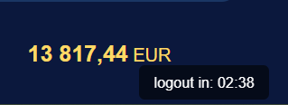

# wagnerbank

(Developer: Felix Lehmann)

This project is a mobile banking app of a fictive savings bank named Wagner Bank. Existing customers can login and review their acounts, including credit cards, deposit acounts etc. Naturally, they can make external payments as well as internal money movements (credit cards are excluded from this feature). Since this app is interactive, it provides many opportunities for further features which haven't been implemented yet, such as registration request, loan requests (mortgages, cars, consumer loans), investment depots etc.

**The challenges** in this project is that everything needs to be written in plain JavaScript - no SQL, no charts, no pandas etc. That has forced me to become somewhat creative in some features: how to save variables? how to update data? how to handle large data set such as transactions lists etc. I will explain in the upcoming chapters.

__Information on test user accounts:__   
The data sets are completely fictive, though somewhat characteristic. To create dummy data I used historical famous persons for user accounts. Their birthdays and other important dates found their way into the IBANs. The transactions as well as the amounts are generated randomly.  
**You will find login data on the top right corner of the start page**

[Live Webpage](https://flexirexi.github.io/wagnerbank/)

___

# Table of content

1. [User Experience](#user-experience)
   1. [Target audience](#target-audience)
   2. [User expectations](#user-expectations)
   3. [User Stories](#user-stories)
      1. [First-time user](#first-time-user)
      2. [Returning user](#returning-user)
   4. [Design](#design)
      1. [Fonts](#font)
      2. [Structure](#structure)
      3. [Wireframes](#wireframes)
2. [Technologies used](#technologies-used)
   1. [Languages](#languages)
   2. [Frameworks & tools](#frameworks-and-tools)
3. [Features](#features)
   1. [Existing features](#existing-features)
   2. [Upcoming features](#upcoming-features)
4. [Testing](#testing)
   1. [Validator testing](#validator-testing)
      1. [HTML](#html)
      2. [CSS](#css)
      3. [Performance](#performance)
      4. [Responsiveness](#responsiveness)
      5. [Accessability](#accessability)
  2. [Fixed bugs](#fixed-bugs)
  3. [Unfixed bugs](#unfixed-bugs)
  4. [User Story testing](#user-story-testing)
5. [Deployment](#deployment)
6. [Credits](#credits)
   1. [Content](#content)
   2. [Media](#media)

# User Experience
## Target audience
- existing clients of Wagner Bank (including test logins)
- clients who want to review and manage their savings from a mobile app rather than a desktop version

## User expectations
- an intuitive and simple web application to review and manage transactions and savings accounts
- visitors quickly can send money
- visual impression (no old legacy stuff, even when it's sometimes the best..)
- modern design that meets the zeitgeist 

## User Stories
### First-time user
*As a first-time user*
- this application is not done for first time user, an account is required (for further development, however, a registration form could be done)

### Returning user
*As a returning user*
- I want to see a dashboard of all my accounts and their current monetary worth
- I want the current consolidated total amount to be shown 
- I want to see the transactions of all my accounts, where when and, if possible, why
- I want to send money to extern third parties
- I want to move money from one account to another with immediate effect
- I want to be logged out automatically after 3 minutes inactivity - I want safety
- I want to subscribe to a newsletter, I am interested but not in a VIP ticket
- I want to see detailed information about my accounts, their interests, limits etc.

## Design
### Fonts
Arial has been used as a neutral font without serifs.
"Cinzel" font (taken from [Google fonts](https://fonts.google.com/specimen/Ubuntu)) is used for headers. Presented in a goldish yellow, it fits to the image of a bank. The unique character of capital letters only (large capitals and small capital letters) undelines the elegance for headers.

### Structure
One core concept of the structure of all pages is that the bodies are not scrollable. Only lists that would exceed the viewport height will be scrollable. I chose this way because the app shall have a mobile character and shall help the visitor to really quickly get things done. Straight to the point so to say.

In fact, there are 4 html pages: login, dashboard, account history and money transfer. They are connected the order mentioned like a chain. For instance, login can't connect to the account details directly and the dashboard can't forward to the money transfer. But all pages can log out the user.

The login page (index.html) is very minimalistic. It becomes clear that this website is for quick use. After a successful login, the visitor will be forwarded to the dashboard like the overview of existing accounts, including the credit card. The non-legacy items of the accounts-list are clickable and will open the transactions page of the respective account. Here, the visitors will see their transaction history and their details. They can also take actions such as sending money.

When sending money or moving money to another account, a classical form will be used. 

### Wireframes in Balsamiq
As already mentioned, the app is primarily designed for mobile use. So, there are only a few features left that need adjustment for different screen sizes. Instead of buttons for the desktop, use a menu on mobile screens. The rest stays the same (apart from some minor size changes..) 

  
login (index.html)

  

  
dashboard page (dashboard.html)

  

  
account history (account.html)

  

  
move and external money transfer (send.html)

  
  

# Technologies used
## Languages
- HTML
- CSS
- JS

## Frameworks and tools
- Git
- GitHub
- Gitpod
- Tinypng
- Greenshot
- Balsamiq
- wave tool
- Google Fonts
- Font Awesome
- Google Chrome dev tools

# Features
## Existing features
### Logo and Navigation bar
- fully responsive
- on all pages
- in mobile size, buttons on the right side of lists "collapse" to a menu button and move to the top right, straight below the nav bar
- within the nav bar, on the right, there is always the possibility to logout
- logo is not clickable, since there is no "home page", the pages within the web app needs to be chained as mentioned earlier 
- on the pages account and send, there are back buttons 

action buttons (mobile mode) as a collapse version of buttons (desktop size):  

action buttons expanded:

### dashboard - the "landing page" for returning visitors:
- non-legacy list layout
- lists all accounts for the logged in user, as well as their current worth and account kind, account name /number:
- sums up all current amounts to a total amount

### automatic logout after 3 minutes inactivity
- important in mobile banking: a timer to logout automatically
- usually, a client who wants to "quickly get things done" tend to forget to log out properly - let the timer do it for him/her
- the feature: at the bottom right the countdown is shown and when the timer reaches 25 seconds (left), then a message box will show up where the visitor has to act to stay logged in

### transaction page
- it's always useful to have an overview of all your recent transactions and current balance
- the visitor will see a list of transactions with details/references and amounts - quite usual mobile banking
- please note: the test accounts have all just fictive data, but the amounts match, also in regards to dates and time (several transactions at the same day which is a realistic scenario)
- the transactions are sorted by datetime, descending, meaning the latest at the top
- in addtion, when the client enters a transaction, it will show up accordingly

### account actions: send/move money
- this is a feature where a desktop user clicks on a button, a mobile user selects from a menu
- the client can "move" money between his/her accounts as well as send extern

### send/move money - form
- after clicking on the action buttons/menu buttons, the visitor will be redirected to a money transfer page, a simple form to fill and confirm
- the features: one can't send/receive money from/to a credit card
- one can't send money to the same account one is sending from
- to prevent the above cases, the money movement form will use a dropdown to prefilter which internal accounts are possible to send to
- when sending money externally, there will be a text input
- accounts are allowed to go negative, but one can't send negative amounts
- also, the smalles interval to send is 1 cent - one can't send fractions of cents
- a feature that is not implemented: precision problem -> after calculating with monetary values the result will be rounded to the full cents

### after second confirmation, what happens?
- the money sent will creat one transaction
- that transaction will be added to the senders account and will affect the current balance with immediate effect
- a money movement is nothing more than a double transaction with a negative value for the sending account and a positive value for the receiving account, the JS will add the amounts moved to both accounts with immediate effect (the current time stamp will be visible in the transaction list)

## Upcoming features

### contineously updating the line-up
- a good organizer keeps its line-up clean otherwise you might loose customers before they are even interested in your event
- each DJ will attract their fans

### faq section update
- the closer the event is the more specific your visitors will have
- eg. which terminal at the airports, are they flying together with other guests?
- to really service the customers, a contact form should be added where visitors can ask openly

# Testing
## Validator testing
### HTML
- done using the W3C Markup validation

index.html:

faq.html:

index.html:

### CSS
- done, using the W3C CSS validation

### Performance
- index.html, faq.html and preregister.html are ok

### Responsiveness
- see responsiveness with https://ui.dev/amiresponsive?

### Accessability
- accessibility was checked with the wave tool

## Fixed Bugs

html for index.html 1:
- 1
- 2
- 3

html for dashboard.html:

html for preregister.html 1:

html for preregister.html 2:

## Unfixed Bugs
- indirect bug: there must be found a way to show the landing page fully covered with an image without impacting the performance of the pageloading (in lighthouse)
- sometimes, rather random, it can happen that lighthouse measures a performance lower than 90%, even with removing all rendering blocking scripts/imports like google fonts and Font awesome. Not even the removal of the landing page image prevents that. Nevertheless, the performance most of the times above 90%.

## User Story testing
### As a first-time user..

**I want to know what kind of festival that is and what I can expect**
- Feature: welcome section
- Action: give the user a brief overview about that festival
- Expected result: the user understands that this is an electronic music festival in the atlantic ocean

[experience](docs/user_stories/us01.png)

**I want to know when and how long it takes place**
- Feature: home landing page and faq page, first header
- Action: inform the user about time and duration 
- Expected result:the user is informed 

[where it takes place](docs/user_stories/us02.png)

**I want to kow wwhere it takes place**
- Feature: landing page and faq page
- Action: inform the user about the location of the festival
- Expected result: the user is informed that this festival is on an island in the atlantic ocean

[where it takes place](docs/user_stories/us02.png)

or faq page:

 

 

**I want to see images and videos that show me the feeling  of the festival - generally, the vibe**
- Feature: gallery1, video section and gallery2
- Action: play the (aftermovie) video gather impressions from the previous events
- Expected result: the user will get an idea how this festival is like

just scroll down the main page:

**I want social media presence: links to tiktok, instagram (possibly face book and X)**
- Feature: footer
- Action: links to official social media channels to connect with other fans/the festival team
- Expected result: the user will be led to the festival's social media sites

### As a returning user...

**I want to know how the stay is being managed**
- Feature: ticket information section
- Action: information and overview of 3 possibilities to stay overnight during the festival
- Expected result: the user will be informed and can prepare for later possible ticket purchases

**I want to know the latest updates for the line-up**
- Feature: line-up section
- Action: keep the user up to date about the artists performing at this event
- Expected result: the user will know the latest status of the line-up

**I want to knwo when the official ticket sale starts**
- Feature: ticket information section
- Action: simply inform the client about the official ticket sale start 
- Expected result: the user is informed that the official sale starts on 20th Jan, 2025 while the vip ticket sale starts one day earlier

**I want detailed information about the tickets, if possible**
- Feature: ticket information section
- Action: inform the client that the ticket category is strongly connected to the overnight stay and flight
- Expected result:the client knows that tickets category is a combination of stay and flight

this information is in the same overview as how the stay is being managed:

**I want to know how I can pre-regiater to buy preferred VIP tickets**
- Feature: vip section on the home page and pre-register web page + the preregister button at the top in the nav bar
- Action: the vip section explains the VIP ticket and has a link to the vip registration form
- Expected result: the user will find the registration web page quite easily and quickly

how to get to the pre-register on the home page:

then fill the form and choose your preferred options:

**I have several organisational questions that might be specific**
- Feature: faq section at the end of the home page and the separate faq page with all information
- Action: the user will be lead to the faq web page where many questions are answered - it will contineously kept up to date
- Expected result: The user is generally provided with many details regarding the tickets, the journes and the festival itself

navigate through the main page:

then, click on the headers to expand the headers:

**I want to subscribe to a newsletter, I am interested but not in a VIP ticket**
- Feature: stay tuned section
- Action: enter name and email to register for the newsletter
- Expected result: the user will be successfully subscribed

# Deployment
The website was deployed using GitHub and GitPod
The deployment was done by GitHub and gitpod:

    In the GitHub repository navigate to the Settings tab
    On the left hand menu select Pages
    For the source select Branch: main
    After refresh you will see at the top: "Your site is published at https://flexirexi.github.io/eternal_land_festival/"

# Credits
## Content
- examples of README files ([Love Running](https://github.com/Code-Institute-Solutions/readme-template) and [Bodelschwinger Hof](https://github.com/4n4ru/CI_MS1_BodelschwingherHof/blob/master/README.md))
- Font Awesome for the icons (4 in total): https://fontawesome.com/

## Code
No code was just copied/pasted. For all problems to solve, I took help from the following websites/people and created my own solutions out of that:

gallery grid: 
by [Reyshawn](https://stackoverflow.com/users/8247439/reyshawn) on [stackoverflow](https://stackoverflow.com/questions/56720810/how-to-resize-multiple-images-side-by-side-to-to-fit-the-current-screen-size)

darken a background-image: 
by [Shin](https://stackoverflow.com/users/3518203/shin) on [stackoverflow](https://stackoverflow.com/questions/23208200/how-to-darken-a-background-using-css)

flexbox - wrap content: 
[Mozilla](https://developer.mozilla.org/en-US/docs/Web/CSS/flex-wrap)

Styling form with label above inputs: 
by [fin1te](https://stackoverflow.com/users/657830/fin1te) on [stackoverflow](https://stackoverflow.com/questions/6046110/styling-form-with-label-above-inputs)

country list for select/dropdown: 
by [Dan Rovito](https://gist.github.com/danrovito) on [github](https://gist.github.com/danrovito/977bcb97c9c2dfd3398a)

how to use details and summaries: 
[W3S](https://www.w3schools.com/tags/tag_summary.asp)

change style of hidden radiobutton + label: 
by [PSL](https://stackoverflow.com/users/1009603/psl) on [stackoverflow](https://stackoverflow.com/questions/16839747/this-css-not-working-for-radio-button-selection)

vertically center when absolute positioning: 
by [Manisha Basra](https://medium.com/@jscodelover?source=post_page-----ea3a9d0ad72e--------------------------------) on [Medium](https://medium.com/front-end-weekly/absolute-centering-in-css-ea3a9d0ad72e)

CodeInstitute:
Thank you for this opportunity

## Media
In order of appearance:
- [festival01](assets/img/festival01.jpg) by [Sebastian Ervi](https://www.pexels.com/@sebastian-ervi-866902/) on [pexels.com](https://www.pexels.com/photo/silhouette-of-people-in-front-of-stage-1763067/)
- [festival02](assets/img/festival02.jpg) by [Wendy Wei](https://www.pexels.com/@wendywei/) on [pexels.com](https://www.pexels.com/photo/purple-fireworks-effect-1190298/)
- [festival03](assets/img/festival03.jpg) by [Wendy Wei](https://www.pexels.com/@wendywei/) on [pexels.com](https://www.pexels.com/photo/people-having-a-concert-1190297/)
- [festival05](assets/img/festival05.jpg) by [Ander Garcia](https://www.pexels.com/@ander-garcia-1317358711/) on [pexels.com](https://www.pexels.com/photo/tattooed-woman-with-braids-posing-on-grass-at-festival-25016443/)
- [festival06](assets/img/festival06.jpg) by [Hamzeh Omari](https://www.pexels.com/@omari/) on [pexels.com](https://www.pexels.com/photo/a-dj-playing-music-and-audience-dancing-at-a-festival-20733818/)
- [festival09](assets/img/festival09.jpg) by [Laura Stanley](https://www.pexels.com/@lstan/) on [pexels.com](https://www.pexels.com/photo/people-in-a-concert-2147029/)
- [festival10](assets/img/festival10.jpg) by [Laura Stanley](https://www.pexels.com/@lstan/) on [pexels.com](https://www.pexels.com/photo/people-in-a-concert-2147029/)
- [festival11](assets/img/festival11.jpg) by [Danial Duarte](https://www.pexels.com/@daniel-duarte-270529097/) on [pexels.com](https://www.pexels.com/photo/crowd-enjoying-themselves-at-a-festival-14670406/)
- [festival12](assets/img/festival12.jpg) by [IslandHopper](https://www.pexels.com/@islandhopper-x-339537771/) on [pexels.com](https://www.pexels.com/photo/smiling-girls-in-sunglasses-at-holi-festival-15325734/)
- [festival13](assets/img/festival) by [Riccardo Vespa](https://www.pexels.com/@riccardo-vespa-594469796/) on [pexels.com](https://www.pexels.com/photo/back-view-of-men-playing-music-on-stage-and-the-audience-having-fun-at-a-festival-17284331/)
- [festival18](assets/img/festival) by [Wendy Wei](https://www.pexels.com/@wendywei/) on [pexels.com](https://www.pexels.com/photo/several-people-at-a-party-1540338/)

- [festival video](https://videos.pexels.com/video-files/3941287/3941287-uhd_2560_1440_30fps.mp4 ) by [Tom Fisk](https://www.pexels.com/@tomfisk/) on [pexels.com](https://www.pexels.com/video/a-drone-footage-of-an-outdoor-concert-3941287/)